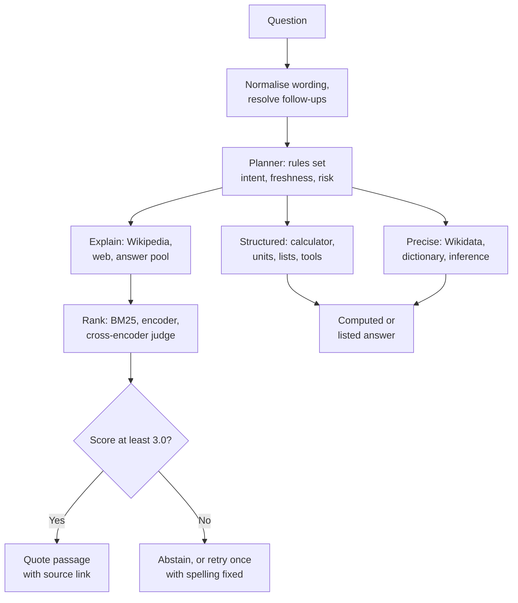
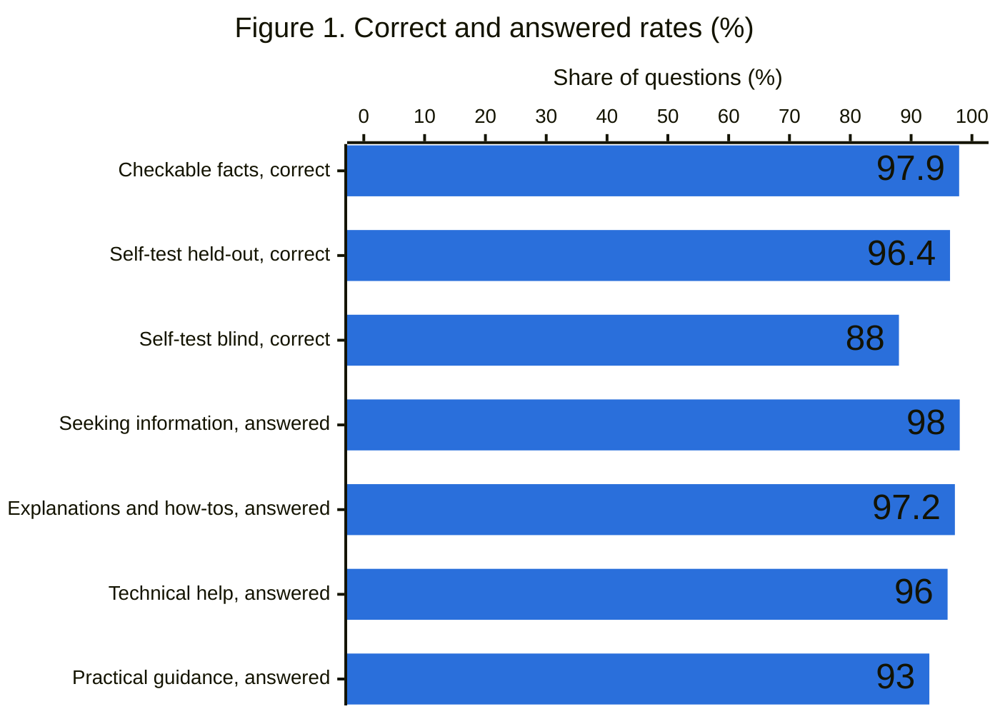
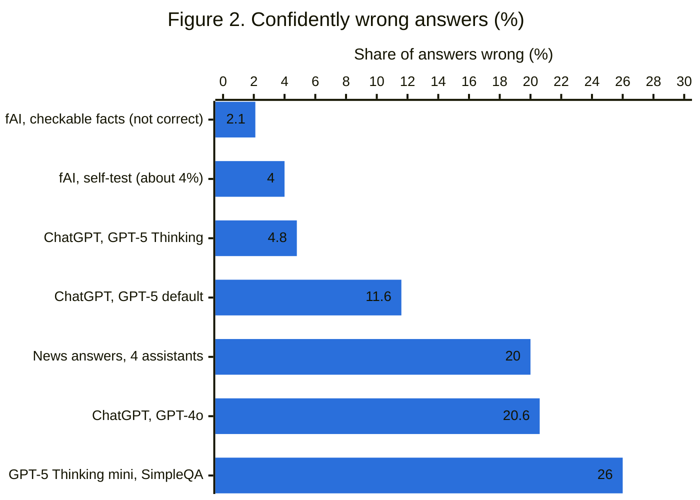
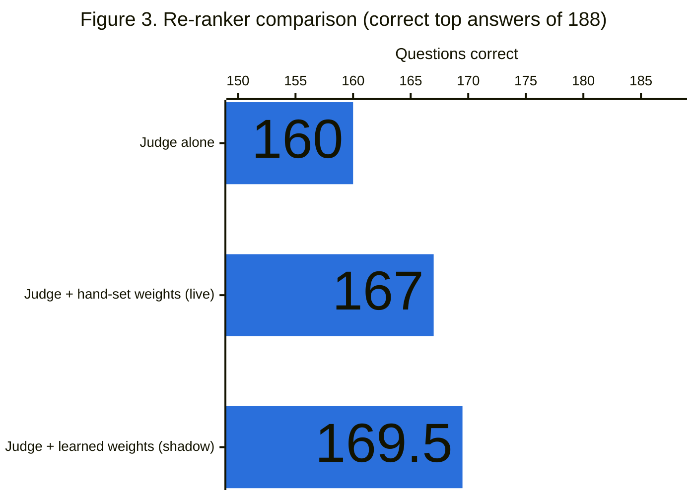
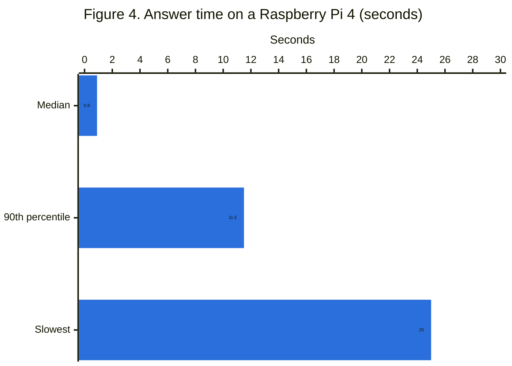
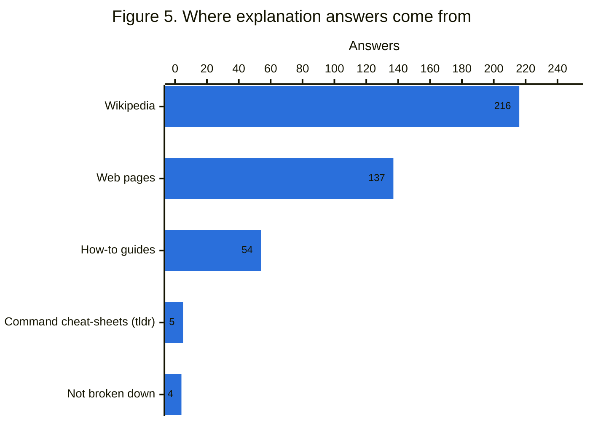
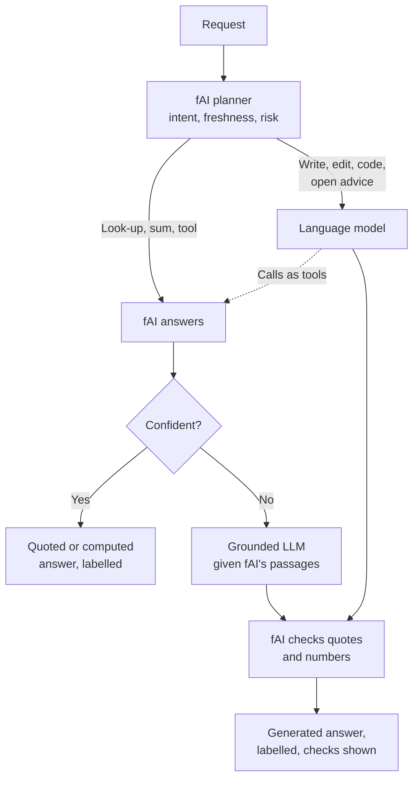

# fAI: a deterministic question-answering engine that cannot make things up

**A white paper on LLM-free question answering: no generative model, no invented sentences, runs on a Raspberry Pi 4.**

Soren Kylor · September 2026 · White paper

> **In short:** fAI ("We Have AI At Home") answers questions by quoting sources word for word, or by computing results with fixed rules. It uses no large language model (LLM), so it cannot make up an answer, and it runs on a Raspberry Pi 4. On 1,806 automatically checked fact questions it was correct 97.9% of the time. It could handle between about a fifth and a half of everyday chatbot messages, and could hand the rest to an LLM through a router.

**Keywords:** deterministic question answering, LLM-free AI, hallucination, extractive question answering, retrieval without generation, RAG alternative, Raspberry Pi AI assistant, offline AI, Wikidata, BM25, cross-encoder re-ranking, abstention

## Contents

- [Abstract](#abstract)
- [Terms used](#terms-used)
- [1. Introduction](#1-introduction)
- [2. History and foundations](#2-history-and-foundations)
- [3. How it works](#3-how-it-works)
- [4. How we measured it](#4-how-we-measured-it)
- [5. Results](#5-results)
- [6. Benefits and what is new](#6-benefits-and-what-is-new)
- [7. Drawbacks and limitations](#7-drawbacks-and-limitations)
- [8. How much of today's chatbot use could this cover?](#8-how-much-of-todays-chatbot-use-could-this-cover)
- [9. Areas worth exploring](#9-areas-worth-exploring)
- [10. Conclusion](#10-conclusion)
- [Frequently asked questions](#frequently-asked-questions)
- [How to cite](#how-to-cite)
- [References](#references)

## Abstract

Most AI chatbots write answers word by word, predicting what text should come next. That makes them fluent, and sometimes wrong in ways that sound right.

fAI ("We Have AI At Home") does not write its answers. It finds the passage that best answers your question and shows it word for word, with a link to its source. Sums, dates, distances and unit conversions are worked out by fixed rules, like a calculator. Simple facts from Wikidata are put into fixed sentence patterns such as "X was written by Y", with the source shown. Asked for a shorter version, it only deletes clauses, and says so. If it cannot find a good answer, it says that and lists what it read.

It is a classical, **deterministic** question-answering engine with **no large language model** (LLM): the same question over the same sources gets the same answer. It can pick the wrong passage. It cannot make one up.

It works over any text it is given: Wikipedia, Wikidata and the web today, but equally a manual, a policy library or a folder of notes. It runs on a Raspberry Pi 4 with 4 GB of memory, so it could run offline with no data leaving the building. It also runs simple tools such as reminders, lists and files. It works in English only.

On 1,806 automatically checked fact questions, many deliberately misspelt or loosely worded, it was correct **97.9%** of the time. It gave an answer to 93% to 98% of a separate set of everyday questions, and to 97% of 428 "why" and "how" questions. Giving an answer is not the same as giving a good one, and no real user has yet rated its answers. All of these questions were written or generated by its author ([terms are defined below](#terms-used)).

In its last full self-test, about **4%** of its answers were confident but wrong. For comparison, OpenAI reports that **4.8%** of responses from ChatGPT's strongest mode (GPT-5 Thinking) and **11.6%** from its default mode contained a major factual error. A 2025 study of news answers from ChatGPT, Copilot, Gemini and Perplexity found major accuracy problems in about **20%**. The question sets differ, so these figures give context rather than a head-to-head result. Half of fAI's answers took under a second.

We estimate that a system like this could handle somewhere between a fifth and a half of consumer chatbot messages: 17% by cautious reasoning, and up to about 55% if its answer rates on its author's questions hold for real users. It could be paired with an LLM through a router for the rest.

## Terms used

| Term | Meaning |
| --- | --- |
| Held-out set | Questions kept aside while the system was built and tuned, then used to check it. They show whether improvements carry over to questions the builder did not tune on |
| Blind set | A stricter held-out set: a pool of 55 questions never looked at during tuning, from which each test run draws 25 at random |
| Regression check | A test confirming that something that used to work still works |
| Self-test | Every test set run end to end on the Raspberry Pi, as the installer does on every install |
| False-confident rate | The share of scored answers fAI gave confidently that did not contain the expected answer. This is fAI's headline quality measure, and the closest match to a chatbot's hallucination rate |
| Hallucination | A fluent statement from a generative model that is false or unsupported by its sources |
| Abstain | Decline to answer, and show the pages read instead |
| LLM | Large language model: a generative model that writes text word by word, as used by ChatGPT, Claude and Gemini |
| Deterministic | The same question over the same sources always gives the same answer |
| Extractive | Answering by selecting text from a source, rather than writing new text |
| RAG | Retrieval-augmented generation: an LLM that searches first, then writes an answer from what it found |
| Wikidata | The free, structured database of facts behind Wikipedia, such as a person's birth date stored as a field |
| BM25 | A standard keyword-matching formula for ranking text by relevance |
| Sentence encoder | A small neural model that turns sentences into numbers, so that similar meanings can be compared |
| Cross-encoder judge | A small neural model that reads a question and a passage together and scores how well the passage answers it |
| Confidence score | fAI's final score for its best passage. Below 3.0 it abstains |
| Planner | The rule set that decides what kind of question it is, how fresh the answer must be, and which handlers to try |
| Freshness class | How quickly an answer changes: static, long-lived, recent or live |
| Cassette | A recording of every web request and response in a run, so the run can be replayed exactly and offline |
| Shadow mode | A new component runs beside the live system and logs what it would have done, without affecting any answer |
| Distant supervision | Labelling training examples automatically (here, by whether a passage contains the expected answer) instead of by hand |
| AUC | A measure of how well a score separates right from wrong: 1.0 is perfect, 0.5 is a coin toss |
| Median, 90th percentile | Half of answers are faster than the median; 90% are faster than the 90th percentile |
| int8 | A compressed number format that lets neural models run quickly on a small processor |
| Prompt injection | Text on a web page crafted to make an AI assistant follow hidden instructions |
| SimpleQA | An OpenAI benchmark of short, hard factual questions |
| Answered | fAI gave an answer rather than abstaining. This is not the same as correct: an answered question may still be answered badly |
| Checkable facts | Questions generated from Wikidata, where the right answer is known from the same record, then asked in varied, misspelt and padded wordings. They test whether fAI understands the question, not whether its sources are right |
| Verbatim integrity | The share of quoted answers whose text is found word for word on the cited page when checked |
| Pairwise selection accuracy | Shown two candidate passages, how often fAI's ranking prefers the same one as a human labeller |
| Engine suspension | A public search engine temporarily refusing requests from fAI's server, usually for sending too many |
| Scenario | A scripted conversation of several turns, checked end to end |
| Data-to-text | Turning database facts into a sentence using fixed, hand-written patterns, with no generative model |

## 1. Introduction

Generative models are trained to produce likely text, and standard evaluations reward guessing over saying "I don't know" ([Kalai et al., 2025](https://openai.com/index/why-language-models-hallucinate/)). In OpenAI's SimpleQA example, a model that abstained on 1% of questions was wrong on 75%. One that abstained on 52% was wrong on 26%, with similar accuracy (24% and 22%).

fAI takes that idea to its end point. Abstaining is a normal outcome, and invention is ruled out by design. It is built from parts that existed before chatbots: search, ranking, rules, and small neural models that score text but never write it. ("fAI" is short for "fake AI".)

> **Contract:** every factual sentence is quoted word for word from a named source, computed by a rule you could check by hand, or filled into a fixed sentence pattern from cited database facts. Otherwise, the system says it cannot answer.

There are two labelled exceptions. On request, quotations are shortened by deletion only. And shell commands are filled in from documented examples with the user's values, shown but never run.

The system ships as a single installer script that builds, tests and starts it. This paper makes three claims:

1. A useful general question-answering assistant can be built with no generative model.
2. It can run on one low-cost board, with every source replaceable by a local copy.
3. It can be improved measurably, because every decision is logged and every web exchange can be replayed.

## 2. History and foundations

Every part of fAI has a published ancestor. What is new is the combination and the no-invention contract. In today's terms, fAI is retrieval-augmented generation (RAG) with the generation step removed: it keeps the search and ranking, and drops the writing.

| Year | System or idea | What fAI takes from it |
| --- | --- | --- |
| 2020 | [RAG](https://arxiv.org/abs/2005.11401) (Lewis et al.) | The retrieve-then-answer shape, without the writing step |
| 2020 | [MiniLM](https://arxiv.org/abs/2002.10957) (Wang et al.) | Small distilled transformers that run on a CPU |
| 2019 | [Sentence-BERT](https://arxiv.org/abs/1908.10084) (Reimers and Gurevych) | Sentence embeddings for a second opinion on relevance |
| 2017 | [DrQA](https://arxiv.org/abs/1704.00051) (Chen et al.) | Search Wikipedia, then read; labelling training data automatically (distant supervision) |
| 2016 | [SQuAD](https://arxiv.org/abs/1606.05250) (Rajpurkar et al.) | The dataset behind fAI's extractive reader, tried and then retired |
| 2012 | [Wikidata](https://en.wikipedia.org/wiki/Wikidata) launched | A free, structured store of facts for rule-based reasoning |
| 2010 to 2011 | [IBM Watson DeepQA](https://onlinelibrary.wiley.com/doi/abs/10.1609/aimag.v31i3.2303) (Ferrucci et al.) | Many evidence scorers merged into one confidence; answer typing; a threshold below which it does not answer |
| 2009 | [Wolfram Alpha](https://en.wikipedia.org/wiki/Wolfram_Alpha) launched | Deterministic computation over curated facts |
| 2009 | [BM25](https://dl.acm.org/doi/10.1561/1500000019) (Robertson and Zaragoza review) | The keyword ranking function at the base of the funnel |
| 1999 | [TREC question answering track](https://pages.nist.gov/trec-browser/trec8/qa/overview/) | Shared test sets and measured progress |
| 1971 | [LUNAR](https://en.wikipedia.org/wiki/Question_answering) (Woods) | Answering questions from a fixed body of data, in a narrow domain |
| 1961 | [BASEBALL](https://dl.acm.org/doi/10.1145/1460690.1460714) (Green et al.) | The first automatic question-answerer over a database |

The closest relatives are Watson, which merged many explainable scores into one confidence and did not answer below a threshold, and DrQA, which paired Wikipedia search with a trained reader. fAI differs in three ways. It runs on a hobby computer. It has no reader, having tried one and retired it. And it shows only the source's own words, apart from labelled command examples and fixed sentence patterns filled from Wikidata.

## 3. How it works

A question is classified, routed to the most likely handlers, and the candidate answers are ranked. The best is quoted if it clears a threshold; otherwise fAI abstains. Every step is a fixed rule, written to a trace.



### The main stages

| Stage | What it does | Why it matters |
| --- | --- | --- |
| Normalise | Rewrites contractions, filler ("Quick question:"), British and American spellings, and synonyms such as "gist", "TL;DR" and "difference between" into standard forms | Parsers see fewer variants; each change is logged |
| Resolve follow-ups | "What about Peru?" or "and its population?" is rebuilt from the previous question, and the rebuilt question is shown. The previous answer's Wikidata ID is pinned, so "and the composer?" after "Who directed Alien?" means the film, not the franchise | Conversations work without guessing what "it" means |
| Repair | Corrections such as "actually, make that Thursday" change the last action or question instead of starting a new one | Mistakes can be fixed without starting again |
| Plan | Ordered rules set the intent, freshness class, answer type and risk, plus an answer contract | Routing becomes data that can be tested and compared |
| Route | About two dozen registered handlers in three stages: structured, precise, explain | New abilities are added without rewriting the router |
| Retrieve | Wikidata, Wikipedia, the web through a self-hosted search engine (SearXNG), Wiktionary, Wikiquote, OpenStreetMap, Stack Overflow, official programming docs (MDN, docs.python.org), wikiHow, a local command-line help index. If the search engines suspend the server, a backup search library takes over, with an optional paid search key (Brave) as a last resort | Each source is swappable for a local copy |
| Rank | BM25 over paragraphs, a small sentence encoder as a 30% second opinion, then a cross-encoder judge over up to 8 candidates | Cheap filters first, expensive judgement last |
| Adjust | 11 named score components plus class-level rules, for example a penalty for passages that open on a dangling "This" or "It", and a bonus when a section heading such as "Cause" or "Mechanism" matches the question | Every score can be explained line by line |
| Answer or abstain | Quote the winner with its link if the final score is 3.0 or more; otherwise offer the pages read | Honest failure instead of a confident guess |
| Spelling (only on failure) | Tried only after a failed plan or an abstention, never first; always announced; vetoed if the word is in the command index, the user's word list or Wiktionary; never used when defining, rhyming or quoting. "I meant linter" teaches it a word | Prevents errors such as "chili" becoming "child", or "linter" becoming "winter" |

### Contract enforcement

- **Freshness.** Each question is classed as static, long-lived, recent or live. Live questions (weather, news) may never be answered from stored text.
- **Answer shape.** A question that needs a list or steps cannot be satisfied by a stray passage, even when search is throttled. This applies only when the planned handler actually ran.
- **Research** needs two usable sites. Video platforms, PDFs and garbled extractions do not count.
- **Outages** are reported as outages ("Wikipedia is down"), not as missing facts.
- **False premises.** A "first ... to" claim is accepted only if the passage itself makes it.
- **Caution notes** are added on medical and legal topics, including employment and consumer questions.

### Reasoning without a language model

Rules over Wikidata handle comparisons with unit conversion, before-and-after questions, age at a date, distances between places from their stored coordinates, and two-step look-ups ("where was the author of X born?"). Each answer states the facts used and cites them. If a fact is missing or the units do not match, fAI abstains.

Wikidata answers are phrased with fixed, hand-written patterns rather than quoted, for example "Pride and Prejudice was written by Jane Austen". Some answers join several stored facts into one sentence in the same way, and may also quote the opening sentence of the Wikipedia article, introduced as "For context, the article opens:". No model chooses the words: the pattern is fixed and each value comes from a cited Wikidata field.

### Answers that are more than one passage

| Ability | What it does | How it stays honest |
| --- | --- | --- |
| Lists of causes, symptoms, types | Collects list items from several independent sites and ranks them by how many agree | Items are the sites' own words; each shows its count of sites and citations; two pages from one site count once |
| Summaries | Picks the sentences the rest of the page most agrees with, favouring the opening and avoiding repeats | Sentences are verbatim and kept in page order |
| Shortening on request | Drops asides, bracketed text and side clauses when the user asks for "briefly" or "the gist" | Deletion only, no words changed or added; labelled, with "quote it in full" to see the original; refused for any sentence with a number, a negation or words like "only", "all", "some" or "unless" |
| Coding help | Sends programming questions and error messages to Stack Overflow and official documentation (MDN for the web, docs.python.org for Python) | Quotes those pages; a request to write code is refused first, then relevant pages are offered |
| Shell commands | Fills in a documented command-line example with the file names, times, sizes and web addresses the user gave | Shows where the example came from; never runs it; checks it with the ShellCheck linter and quotes any warnings |
| Wikipedia list pages | Uses "List of ..." pages as the deciding source when sites disagree | Quoted and linked like any other source |
| Translation of words | Gives an English word in another language, for example Italian, from Wiktionary's translation tables | Quoted from the table with a link; single words and set phrases only, not sentences |
| Recipe scaling | Multiplies a recipe's quantities for more or fewer servings | Arithmetic by fixed rule |

### Where machine learning is used

Small neural models score text; none of them write it. All run in compressed (int8) form on the Pi's processor, and if one fails to load, the system runs without it.

| Model | Job | Approximate time per item on the Pi |
| --- | --- | --- |
| all-MiniLM-L6-v2 | Sentence similarity: a second opinion on relevance, and choosing summary sentences | 95 ms per passage |
| ms-marco-MiniLM-L6-v2 | Cross-encoder judge of question and passage | 230 ms per candidate |
| distilbert-base-uncased-distilled-squad | Extractive reader. Retired: as a signal of whether a passage answers the question it scored an AUC of 0.53, where 0.5 is chance | Switched off by default |

### Tools and conversation

Tools are fixed Python actions. They are triggered only by the user's own sentence matching a pattern, never by a model or by fetched content. Small talk uses 56 intents (about 1,200 examples) and labelled templates. Conversation memory stays on the device.

| Tool family | What it can do today |
| --- | --- |
| Reminders and timers | Set, list and cancel; optionally push to a phone through the free ntfy app |
| Lists | Add, remove, show and clear items on named lists |
| Calendar | Add and delete events in a standard iCalendar file other apps can read |
| Files | Create, add to, read, find and delete plain-text files in one chosen folder |
| Household facts | Store and recall facts such as "the Wi-Fi password is on the fridge" |
| Live look-ups | Weather (Open-Meteo, no key needed), time in a place, nearby places (OpenStreetMap) |
| System | Report the Pi's own status and health |

Safety controls:

- No shell or code execution from user text.
- File tools see one folder and plain-text files only.
- Deletes and overwrites need a yes or no first, and can be undone.
- Every tool needs an access code, and every write is audit-logged.
- Web content cannot trigger a tool. This blocks prompt injection by design, but has not been tested adversarially.
- Security headers, a 64 KB request cap and per-client rate limiting (600 requests a minute by default).

### Extending it

New abilities are registered once, with their intents, freshness, side effects and access needs, and are listed at `/api/capabilities`. The router needs no changes. fAI also offers an OpenAI-compatible `/v1/chat/completions` endpoint, so existing chatbot software can use it unchanged.

## 4. How we measured it

There are two kinds of measurement. The self-test runs on the target hardware on every install, so every change is scored the same way. Larger measurement corpora are run separately, in September 2026. Every question in both was written or generated by the author.

| Test set | What it is | Size in each run | What it guards against |
| --- | --- | --- | --- |
| Core | Behaviours that must always work, such as the calculator, tools and abstention | About 50 checks | Anything that must never break |
| Knowledge | Fixed factual questions that need the network | About 54 questions | Changes in live-source answers |
| Legacy sample | Older test questions, sampled | 25 of 390, random each run | Old questions quietly failing again |
| Held-out | Questions written but not tuned on, later kept as a regression check | 56 questions | Overfitting to the main sets |
| Blind | A pool never looked at during tuning, including multi-turn follow-ups | 25 of 55, random each run | Overfitting, measured more strictly |
| Explanation pool | "Why" and "how" questions with random framings | Varies | Sensitivity to wording |
| Generated | Arithmetic and date questions with answers computed by the test | 23 | Calculator and date errors |
| Fact pool | Facts asked in five different wordings | 20 drawn from 143 facts | Failing when a question is rephrased |
| Spelling and synonyms | Misspellings and alternative phrasings | A fixed suite | Wrong corrections such as "linter" to "winter" |
| Answer shapes | Command assembly, lists and shortening | Self-test cases | New answer types breaking the contract |
| Checkable facts (corpus) | Generated from Wikidata: people, places and works, crossed with relations (born, written by, capital of) and wordings, then roughened with misspellings and filler. The expected answer comes from the same record, so this measures understanding of the question, not knowledge | 1,806 questions | Failing on loose or misspelt wording |
| Topic corpus (corpus) | Questions for each consumer-use topic in Chatterji et al. (2025), split into a half used for tuning and a held-out half. Results are from the held-out half | Two halves | Tuning to the questions; gaps by topic |
| Explanations and how-tos (corpus) | "Why", "how does" and "how to" questions | 428 questions | fAI's weakest question type |
| Scenarios (corpus) | Scripted conversations: corrections, follow-ups, tools, translation | About 30 | Conversations breaking |
| Pairwise labels | On a labelling page, the author picks the better of two candidate passages | Growing | Ranking that only looks good against keyword labels |
| Real-user ratings | Thumbs up or down on live answers | None yet | Every other set being written by the author |

- **False-confident rate**, the headline self-test measure: answers given confidently that miss the expected keywords. Live-data answers are excluded.
- **Correct versus answered.** Checkable facts are scored correct or not against Wikidata. The topic and explanation corpora are scored only as answered or not: whether each answer was good has not been rated.
- **Verbatim integrity.** In each run, about 50 quoted answers are checked word for word against their source pages.
- **Other measures:** pass, warning or critical for each check; abstentions split into honest and needless; planner agreement, freshness violations and steps saved; latency percentiles; engine suspensions per run.
- **Replay.** Every web exchange, page and judge verdict is recorded in a "cassette", so ranking changes can be replayed offline against identical evidence. 27 replayed questions confirm that refactors change nothing.
- **Shadow mode.** New components log their decisions beside the live system before they are allowed to act. The planner went live after matching 59 of 59 answers. The learned re-ranker is still in shadow mode. The reader was retired at an AUC of 0.53.
- **Distant supervision.** Candidates are labelled by whether they contain the answer keywords, following DrQA. This gave 697 labelled candidates across 188 questions with no hand-labelling, though the labels cannot see readability. Pairwise labels by hand now check this.

## 5. Results

The results draw on two sources: the last full self-test on a Raspberry Pi 4, and the measurement corpora run in September 2026 (section 4). Every question was written or generated by the author, and no real user has yet rated an answer.



*Figure 1. Correct and answered rates. Correct = checked against a known answer: checkable facts 97.9% (1,806 questions), self-test held-out 54 of 56, self-test blind 22 of 25. Answered = gave an answer, quality not yet rated: seeking information 98%, explanations and how-tos 416 of 428, technical help 96%, practical guidance 93%. Source: self-test and measurement corpora, supplied by the author.*

Checkable facts test robustness to phrasing: 97.9% of 1,806 questions were answered correctly despite misspellings, filler and unusual word order. The expected answer comes from Wikidata, the source fAI reads, so this measures whether fAI understands the question, not whether Wikidata is right.

The topic and explanation results count answers given. They show that fAI rarely gives up on these questions, not how good the answers are. The self-test's blind score varies with the random draw, from 20 to 24 of 25 across recent runs, so it is best read as roughly 80% to 95%. In the last full self-test, the two held-out misses were a search blocked by a throttling engine and a spelling bug, since fixed. The blind miss (how vaccines work) came from the judge preferring a definition to an explanation of the mechanism.

### Against consumer chatbots

In its last full self-test, fAI's false-confident rate of about 4% sat at the level of the best figure OpenAI has published for ChatGPT, and well below its default mode and independent tests of news answers. On checkable facts, 2.1% of questions were not answered correctly. That counts abstentions as well as wrong answers, so the wrong-answer rate there is at most 2.1%.



*Figure 2. Confidently wrong answers, fAI and consumer chatbots. fAI's 2.1% counts wrong and unanswered together, so it is an upper bound on wrong answers. Different question sets and definitions, so this is context, not a head-to-head result. Sources: OpenAI (August and September 2025), EBU and BBC (October 2025), fAI self-test and checkable facts.*

- **ChatGPT (GPT-5 Thinking, GPT-5 default, GPT-4o):** share of responses with at least one major factual error, measured by OpenAI on real ChatGPT traffic with web browsing on ([GPT-5 system card](https://cdn.openai.com/gpt-5-system-card.pdf), August 2025). OpenAI's later system cards report only relative improvements, so these are the most recent absolute figures we found.
- **News answers:** 22 public broadcasters tested more than 3,000 answers from ChatGPT, Copilot, Gemini and Perplexity in 14 languages. About a fifth had major accuracy issues, and almost half had at least one significant issue of any kind ([EBU and BBC, October 2025](https://www.ebu.ch/research/open/report/news-integrity-in-ai-assistants)).
- **SimpleQA:** hard factual questions answered without web access. GPT-5 Thinking mini abstained on 52% and was wrong on 26% ([OpenAI, September 2025](https://openai.com/index/why-language-models-hallucinate/)).
- **fAI:** its own, easier and narrower test sets. The self-test is scored by expected keywords, and checkable facts by the Wikidata value. A chatbot run on fAI's exact questions has not been done yet, so this is context, not a head-to-head result.

### Abstention

The threshold of 3.0 comes from 188 replayed questions. Below a score of 3 the top candidate was right about half the time; above 4, it was right more than 90% of the time. Abstaining below the threshold is what keeps fAI's false-confident rate low. OpenAI's SimpleQA result shows the same trade-off in chatbots: more abstention, far fewer wrong answers.

### Ranking



*Figure 3. Re-ranker comparison: questions (of 188) where the top-ranked candidate was correct. Judge alone 160; with hand-set weights 167; with learned weights 169 to 170 across runs (leave-one-bundle-out). The axis starts at 150. Source: re-ranker analysis, supplied by the author.*

Learned weights beat hand-set ones by 2 to 3 of 188 questions, which is too small a gap to act on. The unconstrained fit also gave positive weight to readability penalties such as "chatty", because keyword labels cannot see readability. The learned weights stay in shadow mode.

Against the author's own pairwise labels, where at least one good passage existed, fAI's ranking chose the preferred passage about 75% of the time. So roughly one choice in four between good candidates differs from a human's.

Three alternative judges were compared offline on the same recorded evidence: a refit, a model trained on QNLI (question and sentence pairs labelled for whether the sentence answers the question), and a larger MS MARCO cross-encoder. None beat the current judge. These are negative results: a bigger or differently trained judge was not the fix, which points to better labels for "how" questions instead (section 9).

### Planning

The planner's chosen route was followed 97% to 98% of the time, and every retrieval answer was reached in planner order in every run. Answers drawn from stored text when live data was required (freshness violations) numbered 0 or 1 per run. Each retrieval answer was reached 2.3 to 2.4 steps sooner than with a fixed order of handlers.

### Conversations

About 30 scripted conversations are checked end to end. Examples that pass: "actually, make that Thursday" moves the event just created; "how far is it from Bath?" after a question about Bristol is answered from both cities' stored coordinates; and English words are translated into Italian from Wiktionary's tables.

### Speed



*Figure 4. Answer time on a Raspberry Pi 4. Median 0.9 seconds; 90th percentile 10 to 13 seconds; slowest 20 to 30 seconds (bars show the middle of each range across recent runs). Slow answers are those that search the live web. Source: evaluation latency, supplied by the author.*

The slow answers come from live web search: three searches per question, paced 2.5 seconds apart.

### Explanations and how-tos



*Figure 5. Where explanation answers come from: 216 Wikipedia, 137 web pages, 54 how-to guides, 5 command cheat-sheets (tldr), 4 not broken down; 416 answered of 428. Source: explanation corpus, supplied by the author.*

fAI gave an answer to 416 of 428 "why", "how" and "how to" questions (97%). Of the 12 it did not answer, 9 were abstentions and 3 were lost to search-engine throttling. There were 41 retries along the way. Wikipedia supplied about half of the answers and web pages about a third. These answers are counted as given, not rated as good.

### Verbatim integrity

When about 50 quoted answers per run were checked against their source pages, 44 to 49 were found there word for word: roughly 88% to 98%. The contract requires 100%. The mismatches have not yet been examined. They may come from pages changing between fetching and checking, or from text clean-up such as spacing and quotation marks, rather than from altered wording, but this is not established.

### Search-engine suspensions

Public search engines suspended fAI's server between 9 and 55 times per self-test, and this is now the main cause of the remaining misses. Searches are paced, and a backup search library, with an optional paid key, takes over when engines refuse. This is a cost of using free public engines from one address, not of the method: a local search index would remove it.

## 6. Benefits and what is new

- **No invented facts.** An error is a wrong choice of passage, which the user can see and check.
- **Repeatable.** The same sources give the same answer, which suits audit and regulated settings.
- **Any source.** It works over manuals, policy libraries, case notes or an offline copy of Wikipedia.
- **Private and offline-capable.** Nothing needs to leave the device.
- **Cheap.** It runs on one single-board computer, with no graphics card or paid service. Power use has not been measured.
- **Explainable.** Every score is broken into named parts in the trace.
- **Code help without code generation.** It finds Stack Overflow answers and official docs, and fills in shell command templates, checked by a linter and never run.

### What is new

A targeted search found close precedents for every individual claim, so none of them is new on its own. What we did not find is the combination: a general-purpose assistant whose whole output is bound by a quote-or-compute contract, enforced by freshness-typed planning, measured by false-confident rate, and run on a 4 GB board. This search was targeted, not systematic, so the combination's novelty is **uncertain** rather than established.

| Claim | Closest prior work found | What still looks distinctive |
| --- | --- | --- |
| Quote-or-compute contract with abstention | Extractive QA ([DrQA](https://arxiv.org/abs/1704.00051)); abstention by confidence ([Watson](https://onlinelibrary.wiley.com/doi/abs/10.1609/aimag.v31i3.2303), [selective QA](https://arxiv.org/abs/2006.09462)); [Deterministic Quoting](https://mattyyeung.github.io/deterministic-quoting) (2024) guarantees verbatim quotes, but an LLM still writes the rest | Applying the contract to *all* output of a general assistant, with no generative step anywhere |
| Deletion-only shortening | Sentence compression by deletion is an established task ([Filippova et al., 2015](https://aclanthology.org/D15-1042/)) | Only its use as a labelled, reversible exception to a verbatim contract, refused for numbers, negation and quantifiers |
| Freshness classes | Recency-sensitive query classification in web search ([Dong et al., 2010](https://841.io/doc/recency.html)); [FreshQA](https://arxiv.org/abs/2310.03214) (2023) sorts questions into never-, slow- and fast-changing, plus false-premise, which is very close to fAI's classes | Using the class as a hard rule ("forbidden fallbacks"), not as a ranking signal or benchmark label |
| Lists built from agreement | Answer voting across web results ([AskMSR, Brill et al., 2002](https://aclanthology.org/W02-1033/)) | Showing the per-item site count to the user |
| Spelling correction as last resort | Dictionary-gated suggestions are a search-engine default (Elasticsearch's ["missing" mode](https://www.elastic.co/docs/reference/elasticsearch/rest-apis/search-suggesters)); "add to dictionary" is standard in spell-checkers | Little. This is sound engineering, not a contribution |
| Improvement method | Shadow testing ([Amazon SageMaker, 2022](https://aws.amazon.com/blogs/aws/new-for-amazon-sagemaker-perform-shadow-tests-to-compare-inference-performance-between-ml-model-variants)); record and replay of HTTP ([VCR.py](https://vcrpy.readthedocs.io/)); distant supervision (DrQA) | Cassettes that also store the judge's verdicts, and a false-confident rate as the headline measure; modest on their own |
| Rule-based reasoning over Wikidata | Question answering over Wikidata ([QAnswer, Diefenbach et al., 2020](https://link.springer.com/chapter/10.1007/978-3-030-49461-2_25)); [Wolfram Alpha](https://en.wikipedia.org/wiki/Wolfram_Alpha) | Hand-written, auditable rules that show every fact used, routed as one ability among many |
| Runs on a 4 GB board, one script | Self-hosted assistants such as [OpenVoiceOS](https://www.openvoiceos.org/) run on a Raspberry Pi 4 | A no-invention question-answering engine at this size, with its own evaluation built in |

The fair claim is therefore the **combination and the contract**, not any single technique. The two strongest candidates are the whole-output contract and freshness used as a hard rule, but a systematic literature review is needed before either is called new.

## 7. Drawbacks and limitations

The rule that stops fAI inventing also stops it writing, summarising in its own words, or combining ideas.

### Compared with a generative chatbot

|  | fAI | Typical generative chatbot |
| --- | --- | --- |
| Invents facts | No, by design | Sometimes: 4.8% to 11.6% of ChatGPT responses had a major factual error in OpenAI's own tests |
| Answers the same way each time | Yes, for the same sources | Not reliably |
| Shows where each claim came from | Always | Varies by product |
| Writes or edits text | No | Yes |
| Translates | Single words and set phrases from Wiktionary's tables | Whole texts |
| Writes or fixes code | No. It finds Stack Overflow answers and official docs, and fills in documented shell commands without running them | Yes |
| Explains in its own words or adjusts to the reader | No | Yes |
| Combines facts from several sources into one answer | Only through fixed rules and sentence patterns, and lists counted across sites | Yes |
| Hardware | Raspberry Pi 4, 4 GB | Data-centre graphics processors, or a strong local machine for small models |
| Works offline | Possible with local copies of sources; not yet shown | Only with a local model |
| Takes actions (reminders, lists, files) | Yes, through fixed tools behind an access code | Some products, through tool calls the model decides on |
| Languages | English only | Many |

### Limits of the approach

- **Quoting is not the same as being right.** fAI can faithfully quote a page that is wrong, out of date or out of context. Corroboration reduces this but does not remove it.
- **Some questions have no single answering passage.** "How does X work?" questions are the weak spot. A bonus for section headings such as "Mechanism" helps, but the vaccine question is still missed.
- **Shortening can drop context.** It is refused for sentences with numbers, negation or quantifiers, but its effect on readers has not been measured.
- **Follow-ups and spelling fixes can misread intent.** Both are shown to the user, so errors are visible, but they are still errors.
- **Hand-written rules are costly and brittle.** That means about three dozen planner rules, 56 conversation intents, spelling rules and many parsers.
- **Deterministic does not mean frozen.** Live web answers change as the web changes. Cassettes make one run repeatable; they do not freeze the world.

### English only

Much of fAI's intelligence lives in hand-written English rules, not in a multilingual model. No check detects a non-English question and says so, although non-English web pages are filtered out.

| Part | Tied to English because | Effort to change |
| --- | --- | --- |
| Wording normalisation, spelling rules and about three dozen planner rules | Hand-written English patterns | High: rewrite per language |
| 56 conversation intents, about 1,200 examples | English examples and replies | High |
| Tool triggers and date parsing ("next Tuesday at 5") | English patterns | High |
| Template grammars for creative text | English grammar | High |
| Entity recognition (spaCy `en_core_web_sm`) and sentiment (VADER) | English-trained models | Medium: other-language models exist for some languages |
| Sentence encoder and cross-encoder judge | Trained mainly on English data (MS MARCO) | Medium: multilingual versions exist but are larger and slower |
| Word stemming for BM25 | Uses the English Snowball stemmer | Low: Snowball supports other languages |
| Wikipedia and Wikidata look-ups | Set to English in code | Low: the code already takes a language setting, and Wikidata stores labels in many languages |

Each new language needs its own rules and test sets. The coverage estimate in section 8 applies to English speakers only.

### Limits of this study

- **Author-written tests.** Every question set was written or generated by the author, who knows what fAI can do. No real user has yet rated an answer: the thumbs-up and thumbs-down buttons have recorded none. No public benchmark and no baseline on the same hardware have been run, so we make no claim to beat any other system.
- **Answered is not correct.** The topic and explanation corpora count answers given, not answers judged good.
- **Search suspensions** dominate the remaining misses, at 9 to 55 per self-test.
- **Verbatim integrity is 88% to 98%**, not the 100% the contract requires, and the gaps are not yet explained.
- **Command assembly, lists and shortening** have self-tests but have not been measured on a corpus.
- **Offline use is a design property, not a result.** The system still calls Wikipedia, Wikidata and public search engines.
- **No working machine reader.** The SQuAD 1.1 reader scored an AUC of 0.53 and was retired.
- **Narrow scope.** It handles text only, with no voice.

## 8. How much of today's chatbot use could this cover?

**Estimate: between 17% and about 55% of consumer chatbot messages.** The low end is our reasoned estimate of what fAI could answer well. The high end applies fAI's measured answer rates to the three topics we tested, and is a ceiling, because an answer given is not always a good one. We give no central figure until real users have rated answers. The share of business use, or of total computing, would be far lower.

Method: we took topic shares of ChatGPT consumer messages from May 2024 to June 2025 ([Chatterji et al., 2025](https://www.nber.org/papers/w34255)). For practical guidance, seeking information and technical help, we multiplied each share by the share of the author's held-out questions on that topic that fAI answered: 0.29 × 93% + 0.24 × 98% + 0.05 × 96% ≈ 55%. The other topics, which fAI mostly cannot serve, add about 2 points on our reasoned estimates. For the low end, each topic share was multiplied by the share we judge fAI could answer well.

```mermaid
---
config:
  xyChart:
    showDataLabel: false
  themeVariables:
    xyChart:
      plotColorPalette: "#c9d1d9, #2a6fdb"
---
xychart-beta horizontal
    title "Figure 6. What fAI could cover (% of all messages)"
    x-axis "" ["Practical guidance", "Seeking information", "Writing", "Other or unclassified", "Multimedia", "Technical help", "Self-expression"]
    y-axis "Share of all consumer messages (%)" 0 --> 30
    bar [29, 24, 24, 8.6, 7, 5, 2.4]
    bar [27, 23.5, 0.6, 0.85, 0, 4.8, 0.45]
```



*Figure 6. What fAI could cover. Grey = each topic's share of all consumer ChatGPT messages. Blue = fAI's coverage: for practical guidance, seeking information and technical help, the measured ceiling (answer rate × share); for the other topics, our estimate. The reasoned low ends are in the table below. Sources: Chatterji et al. (2025), NBER w34255, topic shares; answer rates from the topic corpus; other coverage is the author's estimate.*

| Topic (share of messages) | Reasoned coverage, answered well | Measured answer rate | Reasoning |
| --- | --- | --- | --- |
| Seeking information (24%) | 50% to 75% | 98% | Facts, definitions, people, places, dates and news are its core. Product advice and "which is best for me" need synthesis |
| Practical guidance (29%) | 12% to 29% | 93% | Includes how-to advice (8.5% of all messages) and tutoring (10.2%). The corpus is mostly one-off how-to questions; adaptive teaching and personal advice are under-represented |
| Technical help (about 5%) | 20% to 40% | 96% | Arithmetic, units and documentation look-ups are handled. Writing or fixing code is not |
| Self-expression (about 2.4%) | 10% to 30% | Not measured | Templated small talk only |
| Writing (24%) | 0% to 5% | Not measured | About two-thirds of writing requests ask to change the user's own text. fAI cannot do this |
| Multimedia (about 7%) | 0% | Not measured | No image creation or analysis |
| Other or unclassified (about 8.6%, derived) | 0% to 20% | Not measured | Unknown mix |

### Caveats

- **It counts messages, not value or effort.** Look-up questions are short and cheap to answer. Writing and coding requests use far more computing per message.
- **It is for consumer use.** Anthropic's June 2026 Economic Index found explanations in 17% of Claude conversations and guidance in 11%, while code and technical work made up about a sixth ([Anthropic, 2026](https://www.anthropic.com/research/economic-index-june-2026-report)). Work-heavy and developer use would give a lower figure.
- **The high end is a ceiling.** It counts answers given, not answers judged good. The questions were written by the author, who knows what fAI can do, and interactive requests such as tutoring are poorly represented. The gap between 93% answered and 12% to 29% answered well in practical guidance is where this matters most.

- **Real-user ratings** would narrow the range: the share of answers users rate as good in each topic, multiplied by that topic's share.
- **Counter-case:** people may value a fluent, tailored explanation more than a correct quotation. That would push the true figure towards the low end. A user study comparing both kinds of system on the same questions would settle it.

## 9. Areas worth exploring

In priority order:

1. **Real-user ratings:** collect thumbs up or down on live answers, then report the share rated good for each topic. This turns the coverage ceiling in section 8 into a measurement, and is the most important missing number.
2. **Better labels for "how" questions,** from more pairwise labels. Selection accuracy is about 75%, and three alternative judges did not beat the current one, so labels, not a bigger judge, look like the lever.
3. **Search without suspensions:** a local search index, or a shared cache of pages, so free public engines stop being the main cause of misses.
4. **Explain the verbatim gaps:** inspect every failed integrity check and classify it as a page change, a clean-up difference or a real alteration.
5. **Public benchmark by replay:** a Natural Questions or SQuAD-open subset, run through cassettes.
6. **Baselines on the same Pi:** a DrQA-style system and a small local RAG model, compared on accuracy, false-confident rate and abstention.
7. **Wider data-to-text:** fixed sentence patterns for dated events, creative works and organisations.
8. **User study:** a quoted passage against a written summary.
9. **Power and cost** per 1,000 questions.
10. **Fully offline run:** a local Wikipedia, a Wikidata extract and a local search index, with the same scores and the network off.
11. **Bring-your-own corpus:** point fAI at a folder and generate a test set from it.
12. **Cross-source synthesis for explanations.** fAI already does this for lists.
13. **A reader trained with unanswerable questions** ([SQuAD 2.0](https://arxiv.org/abs/1806.03822)), which must clearly beat AUC 0.53 in shadow mode.
14. **More Wikidata reasoning:** counting, superlatives, and chains of three or more steps.
15. **Other languages:** first detect non-English questions, then build rules and tests for each language.
16. **Pairing with an LLM**, below.

### Pairing fAI with a language model

fAI is exact, cheap and checkable, but cannot write. An LLM writes, but can invent. fAI already has what a router needs as inputs: a planner that labels intent, freshness and risk; a scored abstention; and an OpenAI-shaped interface.



Dashed line: the LLM calls fAI's abilities (calculator, units, Wikidata reasoning, tools) as tools.

### Three ways to combine them

| Pattern | How it works | What it gains | What it risks |
| --- | --- | --- | --- |
| fAI first, model as fallback | fAI answers when confident; the model is used only on abstention or for generative intents | Most look-up traffic never reaches the model, cutting cost and invention | A router error sends a generative task to fAI, or a fact question to the model |
| Model grounded on fAI's evidence | fAI retrieves and ranks; the model writes a summary from those passages, citing them | Fluent explanations for "how does X work", fAI's weakest area | The model can still misstate what a source says |
| Model as orchestrator, fAI as tools | The model plans and calls fAI's registered abilities, which return exact results | Exact arithmetic, dates and facts inside a flexible conversation | The model decides when to call tools, and may not call them when it should |

### Rules for the pairing

1. **Label every answer by origin**: quoted, computed, or generated. A reader should never mistake generated text for a quotation.
2. **Check generated text deterministically.** fAI can confirm that every quotation the model gives appears word for word in the cited source, and that every number matches its own computation. Sentences that fail are flagged or removed.
3. **Keep tools behind the same gate.** The model may propose an action, but the access code, the yes-or-no confirmation and the audit log still apply. Web content still cannot trigger a tool.
4. **Respect freshness.** A live question must still be answered from live data, even when a model writes the reply.
5. **Keep the router rule-based and logged**, so every routing decision can be replayed and tested like the rest of fAI.

### How to test it

Run fAI alone, an LLM alone and the pair on the same test sets. Measure accuracy, false-confident rate, the share of requests the LLM never sees, latency and cost. That share directly tests the estimate in section 8.

None of this has been built yet. A model small enough for a Pi 4 would likely be slow, and a larger one means a second machine or a paid service.

## 10. Conclusion

A useful question-answering assistant can be built without a generative model, and can run on a hobby computer. On 1,806 generated fact questions with loose and misspelt wording, fAI was correct 97.9% of the time, and it answered 93% to 98% of the author's held-out everyday questions. In its last full self-test it was confidently wrong about 4% of the time: level with the best figure OpenAI has published for ChatGPT (4.8%), and well below its default mode (11.6%). But every test was written by the author and differs from the chatbots' tests, and no real user has yet rated an answer. The results show the method works; they do not show it beats chatbots.

fAI gives up writing, coding and tailored explanation. In return, its answers can be checked, repeated and run anywhere. It could cover somewhere between a fifth and a half of everyday chatbot messages, and real-user ratings will narrow that range. A rule-based router could hand the rest to an LLM, with every answer labelled by where it came from.

## Frequently asked questions

### Can you build an AI assistant without a large language model?

Yes, for a large share of everyday questions. fAI answers with search, ranking, hand-written rules and small neural models that score text but never write it. It gives up writing, editing, coding and tailored explanation in exchange. See [section 3](#3-how-it-works).

### Does fAI hallucinate?

It cannot invent a passage, because every factual sentence is quoted, computed by rule or filled into a fixed pattern from cited facts. It can still choose the wrong passage, or faithfully quote a page that is wrong. In its last full self-test, about 4% of answers were confident but wrong. See [section 5](#5-results).

### How is fAI different from retrieval-augmented generation (RAG)?

fAI is RAG with the generation step removed. It keeps the search and ranking, and shows the source's own words instead of having a model rewrite them. See [section 2](#2-history-and-foundations).

### How does fAI compare with ChatGPT?

OpenAI reports a major factual error in 4.8% of responses from GPT-5 Thinking and 11.6% from GPT-5's default mode. fAI's rate was about 4% on its own, easier and narrower tests. The question sets differ, so this is context, not a head-to-head result. See [Against consumer chatbots](#against-consumer-chatbots).

### Can fAI run offline on a Raspberry Pi?

It runs on a Raspberry Pi 4 with 4 GB of memory, and every source can in principle be replaced by a local copy. A fully offline run has not yet been demonstrated. See [Limits of this study](#limits-of-this-study).

### What can fAI not do?

It cannot write or edit text, write code, explain in its own words or work in languages other than English. It translates single words only. See [section 7](#7-drawbacks-and-limitations).

### Can fAI be paired with an LLM?

Yes, in principle. A rule-based router could send look-ups, sums and tools to fAI and writing tasks to a language model, with fAI checking the model's quotes and numbers. This has not been built yet. See [Pairing fAI with a language model](#pairing-fai-with-a-language-model).

## How to cite

```bibtex
@techreport{fai_white_paper_2026,
  title       = {fAI: a deterministic question-answering engine that cannot make things up},
  author      = {Kylor, Soren},
  year        = {2026},
  month       = sep,
  type        = {White paper},
  institution = {fAI project},
  note        = {LLM-free, extractive question answering on a Raspberry Pi 4}
}
```

## References

### Primary material for this paper

- The fAI installer script, current baseline, September 2026. Code facts were checked against it.
- fAI self-test results, measurement corpora and change notes, supplied by the author, September 2026. Figures 1, 3, 4 and 5, and the measured rates in Figure 6, use these; they have not been independently re-run.

### Cited works

- Anthropic (2026). [Anthropic Economic Index report: Cadences](https://www.anthropic.com/research/economic-index-june-2026-report). Data from April to June 2026.
- Chatterji, A., Cunningham, T., Deming, D., Hitzig, Z., Ong, C., Shan, C. and Wadman, K. (2025). [How People Use ChatGPT](https://www.nber.org/papers/w34255). NBER Working Paper 34255.
- Chen, D., Fisch, A., Weston, J. and Bordes, A. (2017). [Reading Wikipedia to Answer Open-Domain Questions](https://arxiv.org/abs/1704.00051). ACL 2017.
- Ferrucci, D. and others (2010). [Building Watson: An Overview of the DeepQA Project](https://onlinelibrary.wiley.com/doi/abs/10.1609/aimag.v31i3.2303). AI Magazine 31(3).
- Green, B. F. and others (1961). [Baseball: an automatic question-answerer](https://dl.acm.org/doi/10.1145/1460690.1460714). Western Joint Computer Conference.
- Kalai, A. T., Nachum, O. and others (2025). [Why language models hallucinate](https://openai.com/index/why-language-models-hallucinate/). OpenAI.
- Lewis, P. and others (2020). [Retrieval-Augmented Generation for Knowledge-Intensive NLP Tasks](https://arxiv.org/abs/2005.11401).
- Rajpurkar, P., Zhang, J., Lopyrev, K. and Liang, P. (2016). [SQuAD: 100,000+ Questions for Machine Comprehension of Text](https://arxiv.org/abs/1606.05250). EMNLP 2016.
- Rajpurkar, P., Jia, R. and Liang, P. (2018). [Know What You Don't Know: Unanswerable Questions for SQuAD](https://arxiv.org/abs/1806.03822).
- Raspberry Pi Ltd (2019). [Raspberry Pi 4 on sale now from $35](https://www.raspberrypi.com/news/raspberry-pi-4-on-sale-now-from-35/). Launch prices. Prices have since risen ([April 2026 notice](https://www.raspberrypi.com/news/a-new-3gb-raspberry-pi-4-for-83-75-and-more-memory-driven-price-increases/)).
- Reimers, N. and Gurevych, I. (2019). [Sentence-BERT](https://arxiv.org/abs/1908.10084).
- Robertson, S. and Zaragoza, H. (2009). [The Probabilistic Relevance Framework: BM25 and Beyond](https://dl.acm.org/doi/10.1561/1500000019). Foundations and Trends in Information Retrieval 3(4).
- NIST (1999). [TREC-8 question answering track](https://pages.nist.gov/trec-browser/trec8/qa/overview/). NIST.
- Wang, W. and others (2020). [MiniLM: Deep Self-Attention Distillation](https://arxiv.org/abs/2002.10957).
- Wikipedia. [Question answering](https://en.wikipedia.org/wiki/Question_answering) (for LUNAR, 1971), [Wikidata](https://en.wikipedia.org/wiki/Wikidata) and [Wolfram Alpha](https://en.wikipedia.org/wiki/Wolfram_Alpha). Accessed 23 September 2026.
- Model cards: [cross-encoder/ms-marco-MiniLM-L6-v2](https://huggingface.co/cross-encoder/ms-marco-MiniLM-L6-v2).

### Prior work checked for section 6

- Amazon Web Services (2022). [Perform shadow tests to compare inference performance between ML model variants](https://aws.amazon.com/blogs/aws/new-for-amazon-sagemaker-perform-shadow-tests-to-compare-inference-performance-between-ml-model-variants).
- Brill, E., Dumais, S. and Banko, M. (2002). [An Analysis of the AskMSR Question-Answering System](https://aclanthology.org/W02-1033/). EMNLP 2002.
- Diefenbach, D. and others (2020). [QAnswer KG: Designing a Portable Question Answering System over RDF Data](https://link.springer.com/chapter/10.1007/978-3-030-49461-2_25). ESWC 2020.
- Dong, A., Chang, Y., Zheng, Z. and others (2010). [Towards Recency Ranking in Web Search](https://841.io/doc/recency.html). WSDM 2010.
- Elastic. [Suggester examples: term suggester `suggest_mode`](https://www.elastic.co/docs/reference/elasticsearch/rest-apis/search-suggesters). Accessed 24 September 2026.
- Filippova, K. and others (2015). [Sentence Compression by Deletion with LSTMs](https://aclanthology.org/D15-1042/). EMNLP 2015.
- Kamath, A., Jia, R. and Liang, P. (2020). [Selective Question Answering under Domain Shift](https://arxiv.org/abs/2006.09462). ACL 2020.
- OpenVoiceOS. [Project site](https://www.openvoiceos.org/). Accessed 24 September 2026.
- VCR.py. [Documentation](https://vcrpy.readthedocs.io/). Accessed 24 September 2026.
- Vu, T. and others (2023). [FreshLLMs: Refreshing Large Language Models with Search Engine Augmentation](https://arxiv.org/abs/2310.03214).
- Yeung, M. (2024). [Deterministic Quoting: Making LLMs Safer for Healthcare](https://mattyyeung.github.io/deterministic-quoting).

### Consumer chatbot figures

- European Broadcasting Union and BBC (2025). [News Integrity in AI Assistants](https://www.ebu.ch/research/open/report/news-integrity-in-ai-assistants). 21 October 2025.
- OpenAI (2025). [GPT-5 System Card](https://cdn.openai.com/gpt-5-system-card.pdf). 13 August 2025. Figure 1, factuality on ChatGPT production traffic with browsing enabled.
- OpenAI (2026). [GPT-5.5 System Card](https://deploymentsafety.openai.com/gpt-5-5). Reports relative, not absolute, factuality changes.
